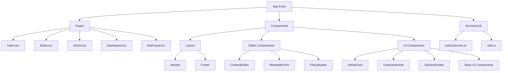

# Design Journalist - Architecture Documentation

## Application Overview

Design Journalist is a modern web application built with React, TypeScript, and Vite, focusing on article creation, management, and publication. The application features a robust editor, category management, and a clean, responsive user interface.

## Architecture Diagram

## Core Components Analysis

### Pages

1. **Index.tsx**
   - Main landing page
   - Features a featured article section
   - Organized category sections (Politics, Technology, Arts)
   - Responsive grid layout for article cards

2. **Editor.tsx**
   - Rich text editing interface
   - Tabbed interface for content and metadata
   - File import capabilities
   - Preview functionality
   - Draft saving and publishing features

3. **Dashboard.tsx**
   - Article management interface
   - Separate views for drafts and published articles
   - Article status management

### Editor Components

1. **ContentEditor.tsx**
   - Rich text editing capabilities
   - Support for pull quotes
   - Paragraph-based content structure

2. **MetadataForm.tsx**
   - Article metadata management
   - Fields for title, category, author, date
   - Image upload and caption support
   - Tag management

3. **FileUploader.tsx**
   - Document import functionality
   - Content extraction from uploaded files
   - Basic content parsing and categorization

### Data Management

The `articleService.ts` implements:
- CRUD operations for articles
- Local storage persistence
- Draft/published state management
- File content extraction
- Unique ID generation
- Category management

## Current Implementation Details

1. **Technology Stack**
   - React + TypeScript
   - Vite for build tooling
   - TailwindCSS for styling
   - Shadcn UI components
   - Local storage for data persistence

2. **UI/UX Features**
   - Responsive design
   - Category-based navigation
   - Rich text editing
   - Live preview
   - Draft management
   - File import support

## Proposed Improvements

1. **Data Management**
   - Implement proper backend integration
   - Add real database storage
   - Implement user authentication
   - Add data validation and sanitization

2. **Editor Enhancements**
   - Add support for more content types (video, embeds)
   - Implement version history
   - Add collaborative editing features
   - Enhance the preview functionality

3. **Performance Optimizations**
   - Implement proper image optimization
   - Add lazy loading for articles
   - Implement proper caching
   - Add service worker for offline capability

4. **Feature Additions**
   - Add search functionality
   - Implement commenting system
   - Add social sharing features
   - Implement analytics tracking
   - Add SEO optimization tools

5. **Testing & Quality**
   - Add unit tests for components
   - Implement E2E testing
   - Add performance monitoring
   - Implement error tracking

6. **Security Enhancements**
   - Add proper authentication
   - Implement role-based access
   - Add content validation
   - Implement proper CSRF protection

## Next Steps

1. **Immediate Priorities**
   - Backend integration
   - User authentication
   - Image optimization
   - Search functionality

2. **Medium-term Goals**
   - Collaborative features
   - Analytics integration
   - Comment system
   - Social sharing

3. **Long-term Vision**
   - AI-powered content suggestions
   - Multi-language support
   - Mobile app development
   - API marketplace for integrations

## Technical Debt Considerations

1. **Current Limitations**
   - Local storage limitations
   - No proper error handling
   - Limited content validation
   - Basic file import functionality

2. **Areas for Refactoring**
   - Implement proper state management
   - Enhance component reusability
   - Improve type definitions
   - Add proper logging system